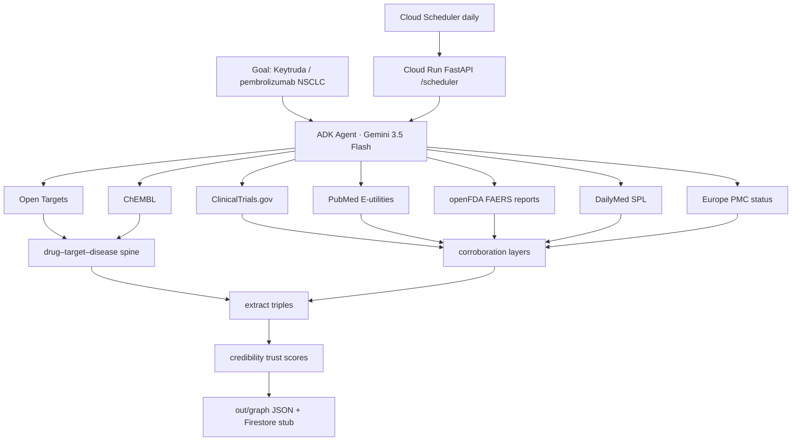

# Living Evidence Graph

**All Things Agentic (The Taskmaster)** submission scaffold  
**Deadline:** 2026-08-31 17:00 PT  

Text-first **living evidence knowledge graph** so LLMs give **more precise, checkable answers** (multimodal later).

**Why it matters:** LLMs **often invent** trial/paper IDs or over-claim from memory. This **unattended Taskmaster agent** keeps a living, trust-scored evidence graph and **grounds** answers on retrieved edges — so results are auditable, not free-form guesses. After you set a goal, it runs by itself (daily fetch → graph refresh → change digest → grounded/strict RAG) without babysitting. Still not clinical advice; FAERS = reports not rates; no causation claims.

**Three modes, one engine:**
- **Public graph (contest demo):** ingest public APIs into a trust-scored KG for RAG.  
- **Personal private graph (product path):** the same Taskmaster builds a **private** KG for an individual researcher — personal literature libraries, notes, and local corpora under their account boundary (not shared with other tenants).  
- **Enterprise private graph (product path):** deploy inside the customer’s environment (VPC / on-prem) to build a **private** KG from org corpora (literature vaults, SOPs, trial docs) under org access controls — data stays in their boundary.

**Demo vertical:** **pembrolizumab / Keytruda** · NSCLC / solid tumor — **public data only** in this repo.

> openFDA FAERS values are **voluntary reports**, not incidence rates, and **not causation**.  
> This project never invents NCT IDs, PMIDs, setids, ChEMBL/Ensembl IDs, or FDA counts.  
> **Not endorsed** by FDA, NLM, NIH, NCBI, Open Targets, or ChEMBL.  
> **LLM path:** retrieval-only over the graph — do not dump PubMed abstracts / non-OA Europe PMC full text into training corpora.

---


## How you use it (closed loop)

**Value:** the living graph exists so **your LLM answers are more precise and checkable** — grounded in retrieved, trust-scored evidence instead of free-form recall that can invent IDs or over-claim.

**Input → result** (not “build a graph and stop”):

1. **Set a goal** — the **public demo in this repo is Keytruda / pembrolizumab + NSCLC** (not a generic “any drug” CLI). For your own files, use **personal** or **enterprise** and point at a folder.
2. **Unattended Taskmaster builds & daily-refreshes the living graph** — Cloud Scheduler → `POST /scheduler` (job `leg-daily-keytruda`); fetches public APIs (or personal/enterprise corpora in private modes), scores credibility, emits change digests — **no human click every day**.
3. **You ask / automate against the graph and get better LLM results:**
   - **Grounded answers** (`POST /rag`) — public graphs inject the **whole living graph**, ranked (demo Keytruda/NSCLC = all 10). Personal libraries default `k=32`; enterprise default `k=128`. `k` is optional; `0` / `all` / `null` = full graph. Never invent edges if the graph is smaller than `k`.
   - **Strict / library-only mode** (`POST /rag` with `"strict": true`) — answers **only** from the living graph’s configured sources (public demo: the 7 APIs) **or** a personal/enterprise private library graph. If nothing relevant is retrieved → reply clearly that **no related information was found** and **do not invent** any other answer (no bare-model freestyle). Not a claim of medical certainty — only from the evidence graph / library; abstain if missing.
   - **Auditable citations** — NCT / PMID / label / KB links on every used edge; FAERS = **reports**, not rates; **not** causation or clinical advice.
   - **Freshness / autonomy** — daily unattended refresh + change digest (**what** / **why** / **sources**) so answers track new public evidence without babysitting.

Same loop in all three modes (Public / Personal private / Enterprise private); only the data boundary changes.

## Core motif (LLM retrieval spine)

```
Drug ──drug_targets_gene──► Gene ──gene_associated_with_disease──► Condition
  │                                                                  ▲
  └──────────── drug_indicated_for_disease ──────────────────────────┘
```

**Spine sources:** Open Targets (CC0) + ChEMBL (CC BY-SA 3.0).  
**Corroboration:** ClinicalTrials.gov · PubMed · openFDA · DailyMed · Europe PMC.

See [docs/CREDIBILITY.md](docs/CREDIBILITY.md), [LICENSES.md](LICENSES.md).

---

## Contest must-haves (checklist)

| Requirement | Where |
|-------------|--------|
| Gemini **3.5 Flash** via **Gemini API** (AI Studio key, **not** Vertex default) | `GEMINI_MODEL`, `GOOGLE_GENAI_USE_VERTEXAI=false` |
| **Google ADK** agent + tools | `living_evidence_graph/agent.py` |
| **Cloud Run** `us-central1`, **min-instances 0** | `deploy/cloudrun.yaml`, `deploy/README.md` |
| **Cloud Scheduler** daily | `deploy/scheduler.yaml` → `POST /scheduler` |
| **Firestore** (optional adapter; local JSON default) | `graph_store.py` |
| Public sources (7 families, APIs not scraping) | `tools/fetch_*.py` |

Public repo: https://github.com/qxiong888/living-evidence-graph

---

## Architecture



See [docs/architecture.md](docs/architecture.md), [docs/CREDIBILITY.md](docs/CREDIBILITY.md).

---

## Schema

**Entities:** Drug · Condition · Gene · Trial (NCT) · Publication (PMID) · AdverseEventConcept · SourceDoc  

**Spine edges:** `drug_targets_gene` · `gene_associated_with_disease` · `drug_indicated_for_disease`  

**Corroboration edges:** `treats_indication` · `studied_in` · `reports_ae` · `warns_ae` · `supports` · `contradicts` · `cites`  

Each edge carries `evidence_urls[]`, `sources[]`, `first_seen`, `last_seen`, `trust_score` (0–1), `trust_breakdown{}`.

---

## Attribution (demo / README)

| Source | Attribution |
|--------|-------------|
| Open Targets | CC0 1.0 — no endorsement |
| ChEMBL | CC BY-SA 3.0 — cite Mendez et al., NAR 2019 (doi:10.1093/nar/gky1075); version when available; ShareAlike on derived subsets; no endorsement |
| openFDA | FAERS voluntary reports — not rates; not an FDA endorsement |
| ClinicalTrials.gov / DailyMed / PubMed | Courtesy of the U.S. National Library of Medicine — not endorsed by NLM/NIH/NCBI |
| Europe PMC | Per-article license for full text; we store status metadata only |
| NCBI | [NCBI disclaimer / policies](https://www.ncbi.nlm.nih.gov/home/about/policies/) |

Full detail: [LICENSES.md](LICENSES.md).

---

## Clone and run

**Python 3.11+** (Docker uses 3.12). Every command below is from the **repo root** after clone.

```bash
git clone https://github.com/qxiong888/living-evidence-graph.git
cd living-evidence-graph
python3 -m venv .venv && source .venv/bin/activate   # Windows: .venv\Scripts\activate
pip install -r requirements.txt
cp .env.example .env
# optional: GEMINI_API_KEY from https://aistudio.google.com/apikey
# Tests, graph build, and /rag retrieval work without a key.
# Bare / grounded / strict prose needs the key (otherwise status=gemini_skipped).

pytest tests/ -q
```

Keep using this directory for `uvicorn` and `python -m living_evidence_graph.*` so the package imports.

### Public (contest demo — Keytruda / NSCLC only)

**Cloud Run vs this repo.** The hosted contest demo ([Cloud Run](https://living-evidence-graph-892760629727.us-central1.run.app)) is **frozen** at the baked 14-node / 10-edge Keytruda/NSCLC graph until contest results are announced. Daily refresh is paused so the live pages stay on that snapshot. **This GitHub checkout is what you run yourself** — clone it, start the server locally, and use personal/enterprise to point at your own folder. The public-API ingest path in this repo is still the contest Keytruda/NSCLC vertical (no generic `--drug` / `--indication` yet); `POST /run?goal=...` refreshes that same vertical, not a new drug.

```bash
# optional live rebuild of that vertical (needs network; sources skip on failure — no invented IDs)
python scripts/demo_local.py
# → out/demo/demo_card.html + demo_card.json
# → out/graph/pembrolizumab_non_small_cell_lung_cancer.json

python scripts/demo_rag.py
# → out/demo/rag_compare.html + rag_compare.json
# Answers labeled gemini_skipped if GEMINI_API_KEY / GOOGLE_API_KEY unset

uvicorn living_evidence_graph.server:app --host 0.0.0.0 --port 8080
# cold start seeds fixtures/demo_graph/ (14 nodes / 10 edges) if the slug file is missing
# GET /  ·  GET /compare  ·  GET /update  ·  GET /push
# GET /health  ·  GET /graph  ·  GET/POST /rag  ·  POST /session/push  ·  GET /session
# POST /run  ·  POST /scheduler  ·  POST /library/ingest  ·  GET /library/{slug}
```

```bash
curl -s localhost:8080/health
curl -s localhost:8080/graph
curl -s localhost:8080/rag
# GET /rag: default mixed question, omitted k = all public edges, strict=true

curl -s localhost:8080/rag -H 'content-type: application/json' \
  -d '{"question":"What high-trust edges link pembrolizumab to NSCLC?","strict":true}'

# refresh the same public demo (goal is a query param, not JSON)
curl -s -X POST 'localhost:8080/run'
```

`POST /rag` fields: `question`, `k`, `strict`, `graph_slug`, `library_slug`, `session_id`. There is no `mode` or `graph_id` field. JSON `{"goal":"..."}` is only for `POST /scheduler`.

**k (public):** omitted = every ranked edge. `"k": 0` / `"all"` / `null` = full graph. Opt into `k` without a number → `k=32`.

### Personal (your folder)

Point the Taskmaster at a **local directory**. Separate from the public Keytruda graph — never mixed.

Supported files: `.txt` `.md` `.html` `.csv` `.json` `.pdf` (via pypdf).

**First ingest registers the folder.** While **uvicorn** or CLI `--watch` is running, add / edit / delete auto-rebuilds the private graph (debounced ~1s). Cloud Run’s public demo has no user folders.

```bash
# one-shot
python -m living_evidence_graph.private_ingest \
  --dir /path/to/my-papers --slug my-lib --mode personal

# first ingest, then auto-refresh until Ctrl-C
python -m living_evidence_graph.private_ingest \
  --dir /path/to/my-papers --slug my-lib --mode personal --watch
```

Or with the server already up:

```bash
curl -s localhost:8080/library/ingest -H 'content-type: application/json' \
  -d '{"path":"/path/to/my-papers","slug":"my-lib","mode":"personal"}'
curl -s localhost:8080/library/my-lib
curl -s localhost:8080/rag -H 'content-type: application/json' \
  -d '{"question":"What does my library say about PDCD1?","strict":true,"library_slug":"my-lib"}'
```

Slug is normalized (`my-lib` → on-disk `out/graph/private_my_lib.json` + `.manifest.json`). Later refreshes write `out/graph/private_my_lib.changes.json`.

**k (personal):** omitted = 32. `"k": 0` / `"all"` / `null` = full private graph.

Private edges cite **file paths only** (no fake PMIDs/NCTs).

### Enterprise (your org vault)

Same engine as personal. `--mode enterprise` sets `meta.mode` so omitted `k` is **128**.

```bash
python -m living_evidence_graph.private_ingest \
  --dir /path/to/org-vault --slug org-lib --mode enterprise --watch

curl -s localhost:8080/library/ingest -H 'content-type: application/json' \
  -d '{"path":"/path/to/org-vault","slug":"org-lib","mode":"enterprise"}'
curl -s localhost:8080/rag -H 'content-type: application/json' \
  -d '{"question":"What does the vault say about PDCD1?","strict":true,"library_slug":"org-lib"}'
```

**k (enterprise):** omitted = 128. `"k": 0` / `"all"` / `null` = full graph.

---

## Package layout

```
living_evidence_graph/
  agent.py          # ADK tools: ingest_goal, fetch_sources, extract_edges, …
  server.py         # FastAPI (/health /run /scheduler /rag /library/*)
  private_ingest.py # personal/enterprise folder → private living graph
  library_watch.py  # auto-refresh private graphs when the folder changes
  rag.py            # retrieve all ranked edges (optional k cap) → bare / grounded / strict
  extract.py        # triples (Gemini JSON structure when keyed; else rules)
  credibility.py    # pure trust formula
  graph_store.py    # local JSON + Firestore stub
  tools/
    fetch_clinicaltrials.py
    fetch_pubmed.py
    fetch_openfda.py
    fetch_dailymed.py
    fetch_europepmc.py
    fetch_opentargets.py
    fetch_chembl.py
```

---


## RAG retrieval demo (judge beat ~30–40s)

**Compare punchline:** the same mixed question has graph-backed facts (NSCLC indication, PDCD1, DailyMed warnings, KEYNOTE-799) **plus KEYNOTE-888, which is not in the 14/10 graph**. Bare may invent; grounded cites openable edge IDs; strict answers the graph-backed clauses and leaves the KEYNOTE-888 clause empty. Not who writes better — who does not invent what the graph lacks.

1. Ask a Keytruda / NSCLC question (`GET /rag` in a browser, `POST /rag`, or `scripts/demo_rag.py`).
2. Retriever ranks edges by **trust_score** + keyword/entity overlap (boosts triangle spine + `evidence_urls`). **Public** default = every edge. **Personal** default `k=32`. **Enterprise** default `k=128`. Ranking does not hide edges on the public full-graph path. Optional `k`; if a public caller opts into `k` without a number, `k=32`. `0` / `all` / `null` = full graph. Graph smaller than `k` still injects all edges.
3. Show **bare Gemini** vs **grounded Gemini** (system instruction: cite only provided edges; refuse causation/rates; say when graph lacks evidence).
4. Optional **strict / library-only**: `"strict": true` returns a third answer that uses **only** those graph edges (or abstains with a fixed message if the graph is empty — Gemini is not called).
5. Point at `out/demo/rag_compare.html` — retrieval-only, no fine-tuning, no abstract dumps into training.

```bash
# Browser / GET (default mixed question, all ranked edges, strict=true)
curl -s localhost:8080/rag

curl -s localhost:8080/rag -H 'content-type: application/json' \
  -d '{"question":"What high-trust edges link pembrolizumab to NSCLC?"}'

# Strict / library-only (bare + grounded + strict for contrast)
curl -s localhost:8080/rag -H 'content-type: application/json' \
  -d '{"question":"What high-trust edges link pembrolizumab to NSCLC?","strict":true}'
```


## Safety / legal posture

- Public **APIs** only (no scraping as primary path) · no PHI · not a medical product  
- No causation / comparative efficacy claims · reports ≠ rates  
- Fixture files under `fixtures/` are **clearly labeled**; new sources **skip** on failure  
- See [LICENSES.md](LICENSES.md) for ShareAlike / attribution


## Judges: hit live `/rag` on Cloud Run

The live service is **frozen** at the baked 14/10 Keytruda/NSCLC graph until contest results are announced (scheduler paused). To run your own instance or point at your own files, use this repo — see [Clone and run](#clone-and-run).

Public service (min-instances 0, `us-central1`):

`https://living-evidence-graph-892760629727.us-central1.run.app`

```bash
# Demo hub + one-click push / compare / update (HTML)
# https://living-evidence-graph-892760629727.us-central1.run.app/
# https://living-evidence-graph-892760629727.us-central1.run.app/push
# https://living-evidence-graph-892760629727.us-central1.run.app/compare
# https://living-evidence-graph-892760629727.us-central1.run.app/update

# Browser-openable RAG (default mixed question, all ranked edges, strict=true)
# https://living-evidence-graph-892760629727.us-central1.run.app/rag
curl -sS https://living-evidence-graph-892760629727.us-central1.run.app/rag

# Health (includes seeded demo node_count / edge_count)
curl -sS https://living-evidence-graph-892760629727.us-central1.run.app/health

# Demo graph (baked 14 nodes / 10 edges on cold start)
curl -sS https://living-evidence-graph-892760629727.us-central1.run.app/graph

# Bare vs grounded (Keytruda / NSCLC demo graph already on the service; whole graph injected)
curl -sS https://living-evidence-graph-892760629727.us-central1.run.app/rag \
  -H 'content-type: application/json' \
  -d '{"question":"What NSCLC indication and PDCD1 target does the graph list for Keytruda (pembrolizumab), what does DailyMed warn about pneumonitis and hepatitis, and what is KEYNOTE-799 (NCT03631784) in Stage III? What is the OS hazard ratio for KEYNOTE-888?"}'

# Strict (graph-only; abstain if empty)
curl -sS https://living-evidence-graph-892760629727.us-central1.run.app/rag \
  -H 'content-type: application/json' \
  -d '{"question":"What NSCLC indication and PDCD1 target does the graph list for Keytruda (pembrolizumab), what does DailyMed warn about pneumonitis and hepatitis, and what is KEYNOTE-799 (NCT03631784) in Stage III? What is the OS hazard ratio for KEYNOTE-888?","strict":true}'
```

Local twin: `python scripts/demo_rag.py` → `out/demo/rag_compare.html`. Live pages: `/compare`, `/update`, `/push`.

**One-click push (live at `/push`):** unattended agent updates the living graph → notifies the user (“Living Evidence Graph updated — N edges. Push into your LLM?”) → user clicks **Import / Push to LLM** → `POST /session/push` binds **this demo session** to the public Keytruda slug (cookie + `session_id`; `GET /rag` and `POST /rag` honor it). Push enables **two modes** the user chooses: **Grounded** (retrieve/inject edges as RAG context — not graph-only) and **Strict** (answers only from the graph; abstain if empty). No file download and no manual import steps — still RAG, not fine-tuning. Push is not “answers only from the graph” unless they pick Strict. Compare (`/compare`) and first-build update (`/update`) are live HTML on the same service.

