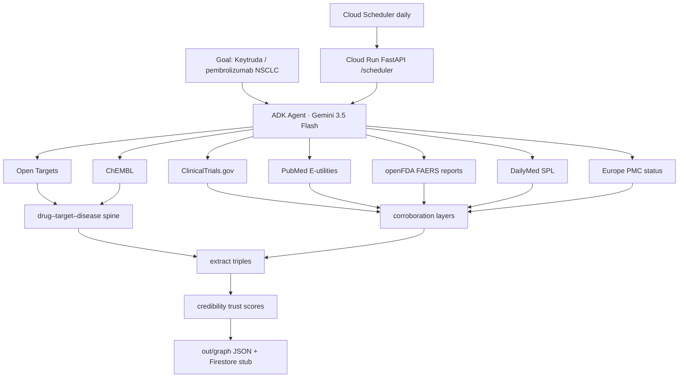

# Living Evidence Graph

**All Things Agentic (The Taskmaster)** submission scaffold  
**Deadline:** 2026-08-31 17:00 PT  

Text-first **living evidence knowledge graph** so LLMs give **more precise, checkable answers** (multimodal later).

**Why it matters:** LLMs **often invent** trial/paper IDs or over-claim from memory. This Taskmaster agent keeps a living, trust-scored evidence graph and **grounds** answers on retrieved edges — so results are auditable, not free-form guesses. Still not clinical advice; FAERS = reports not rates; no causation claims.

**Three modes, one engine:**
- **Public graph (contest demo):** ingest public APIs into a trust-scored KG for RAG.  
- **Personal private graph (product path):** the same Taskmaster builds a **private** KG for an individual researcher — personal literature libraries, notes, and local corpora under their account boundary (not shared with other tenants).  
- **Enterprise private graph (product path):** deploy inside the customer’s environment (VPC / on-prem) to build a **private** KG from org corpora (literature vaults, SOPs, trial docs) under org access controls — data stays in their boundary.

**Demo vertical:** **pembrolizumab / Keytruda** · NSCLC / solid tumor — **public data only** in this repo.

> openFDA FAERS values are **voluntary reports**, not incidence rates, and **not causation**.  
> This project never invents NCT IDs, PMIDs, setids, ChEMBL/Ensembl IDs, or FDA counts.  
> **Not endorsed** by FDA, NLM, NIH, NCBI, Open Targets, or ChEMBL.  
> **LLM path:** retrieval-only over the graph — do not dump PubMed abstracts / non-OA Europe PMC full text into training corpora.

---


## How you use it (closed loop)

**Value:** the living graph exists so **your LLM answers are more precise and checkable** — grounded in retrieved, trust-scored evidence instead of free-form recall that can invent IDs or over-claim.

**Input → result** (not “build a graph and stop”):

1. **You enter a goal** — drug + indication / research question (demo default: Keytruda / pembrolizumab + NSCLC).
2. **Taskmaster builds & daily-refreshes the living graph** — public APIs (or personal/enterprise corpora in private modes), credibility scores, change digests.
3. **You ask / automate against the graph and get better LLM results:**
   - **Grounded answers** (`POST /rag`) — Gemini may only use top-k high-trust edges (demo: bare vs grounded).
   - **Strict / library-only mode** (`POST /rag` with `"strict": true`) — answers **only** from the living graph’s configured sources (public demo: the 7 APIs) **or** a personal/enterprise private library graph. If nothing relevant is retrieved → reply clearly that **no related information was found** and **do not invent** any other answer (no bare-model freestyle). Not a claim of medical certainty — only from the evidence graph / library; abstain if missing.
   - **Auditable citations** — NCT / PMID / label / KB links on every used edge; FAERS = **reports**, not rates; **not** causation or clinical advice.
   - **Freshness** — daily refresh + change digest (**what** / **why** / **sources**) so answers track new public evidence.

Same loop in all three modes (Public / Personal private / Enterprise private); only the data boundary changes.

## Core motif (LLM retrieval spine)

```
Drug ──drug_targets_gene──► Gene ──gene_associated_with_disease──► Condition
  │                                                                  ▲
  └──────────── drug_indicated_for_disease ──────────────────────────┘
```

**Spine sources:** Open Targets (CC0) + ChEMBL (CC BY-SA 3.0).  
**Corroboration:** ClinicalTrials.gov · PubMed · openFDA · DailyMed · Europe PMC.

See [docs/CREDIBILITY.md](docs/CREDIBILITY.md), [LICENSES.md](LICENSES.md).

---

## Contest must-haves (checklist)

| Requirement | Where |
|-------------|--------|
| Gemini **3.5 Flash** via **Gemini API** (AI Studio key, **not** Vertex default) | `GEMINI_MODEL`, `GOOGLE_GENAI_USE_VERTEXAI=false` |
| **Google ADK** agent + tools | `living_evidence_graph/agent.py` |
| **Cloud Run** `us-central1`, **min-instances 0** | `deploy/cloudrun.yaml`, `deploy/README.md` |
| **Cloud Scheduler** daily | `deploy/scheduler.yaml` → `POST /scheduler` |
| **Firestore** (optional adapter; local JSON default) | `graph_store.py` |
| Public sources (7 families, APIs not scraping) | `tools/fetch_*.py` |

Public repo: https://github.com/qxiong888/living-evidence-graph

---

## Architecture



See [docs/architecture.md](docs/architecture.md), [docs/CREDIBILITY.md](docs/CREDIBILITY.md).

---

## Schema

**Entities:** Drug · Condition · Gene · Trial (NCT) · Publication (PMID) · AdverseEventConcept · SourceDoc  

**Spine edges:** `drug_targets_gene` · `gene_associated_with_disease` · `drug_indicated_for_disease`  

**Corroboration edges:** `treats_indication` · `studied_in` · `reports_ae` · `warns_ae` · `supports` · `contradicts` · `cites`  

Each edge carries `evidence_urls[]`, `sources[]`, `first_seen`, `last_seen`, `trust_score` (0–1), `trust_breakdown{}`.

---

## Attribution (demo / README)

| Source | Attribution |
|--------|-------------|
| Open Targets | CC0 1.0 — no endorsement |
| ChEMBL | CC BY-SA 3.0 — cite Mendez et al., NAR 2019 (doi:10.1093/nar/gky1075); version when available; ShareAlike on derived subsets; no endorsement |
| openFDA | FAERS voluntary reports — not rates; not an FDA endorsement |
| ClinicalTrials.gov / DailyMed / PubMed | Courtesy of the U.S. National Library of Medicine — not endorsed by NLM/NIH/NCBI |
| Europe PMC | Per-article license for full text; we store status metadata only |
| NCBI | [NCBI disclaimer / policies](https://www.ncbi.nlm.nih.gov/home/about/policies/) |

Full detail: [LICENSES.md](LICENSES.md).

---

## Local spin-up

```bash
cd /workspace/living-evidence-graph
python -m venv .venv && source .venv/bin/activate
pip install -r requirements.txt
cp .env.example .env   # optional: set GEMINI_API_KEY from AI Studio

# Unit tests (credibility + RAG retriever; no live Gemini required)
pytest tests/ -q

# One-pass demo (live APIs with timeout; fixtures only for CT/PubMed/openFDA;
# DailyMed / Europe PMC / Open Targets / ChEMBL skip on failure — no invented IDs)
python scripts/demo_local.py
# → out/demo/demo_card.html + demo_card.json
# → out/graph/pembrolizumab_non_small_cell_lung_cancer.json

# RAG retrieval compare (bare Gemini vs graph-grounded; works without API key)
python scripts/demo_rag.py
# → out/demo/rag_compare.html + rag_compare.json
# Answers labeled gemini_skipped if GEMINI_API_KEY / GOOGLE_API_KEY unset

# HTTP API
uvicorn living_evidence_graph.server:app --host 0.0.0.0 --port 8080
# GET /health  ·  POST /run  ·  POST /scheduler  ·  POST /rag
```

**Assumed drug strings for the demo:** brand `Keytruda`, ingredient `pembrolizumab`, condition `non-small cell lung cancer`.

---

## Package layout

```
living_evidence_graph/
  agent.py          # ADK tools: ingest_goal, fetch_sources, extract_edges, …
  server.py         # FastAPI (/health /run /scheduler /rag)
  rag.py            # retrieve top-k edges → bare / grounded / strict Gemini
  extract.py        # triples (Gemini JSON structure when keyed; else rules)
  credibility.py    # pure trust formula
  graph_store.py    # local JSON + Firestore stub
  tools/
    fetch_clinicaltrials.py
    fetch_pubmed.py
    fetch_openfda.py
    fetch_dailymed.py
    fetch_europepmc.py
    fetch_opentargets.py
    fetch_chembl.py
```

---


## RAG retrieval demo (judge beat ~30–40s)

1. Ask a Keytruda / NSCLC question (`POST /rag` or `scripts/demo_rag.py`).
2. Retriever ranks edges by **trust_score** + keyword/entity overlap (boosts triangle spine + `evidence_urls`).
3. Show **bare Gemini** vs **grounded Gemini** (system instruction: cite only provided edges; refuse causation/rates; say when graph lacks evidence).
4. Optional **strict / library-only**: `"strict": true` returns a third answer that uses **only** retrieved edges (or abstains with a fixed message if retrieval is empty — Gemini is not called).
5. Point at `out/demo/rag_compare.html` — retrieval-only, no fine-tuning, no abstract dumps into training.

```bash
curl -s localhost:8080/rag -H 'content-type: application/json' \
  -d '{"question":"What high-trust edges link pembrolizumab to NSCLC?","k":8}'

# Strict / library-only (bare + grounded + strict for contrast)
curl -s localhost:8080/rag -H 'content-type: application/json' \
  -d '{"question":"What high-trust edges link pembrolizumab to NSCLC?","k":8,"strict":true}'
```

## Safety / legal posture

- Public **APIs** only (no scraping as primary path) · no PHI · not a medical product  
- No causation / comparative efficacy claims · reports ≠ rates  
- Fixture files under `fixtures/` are **clearly labeled**; new sources **skip** on failure  
- See [LICENSES.md](LICENSES.md) for ShareAlike / attribution
