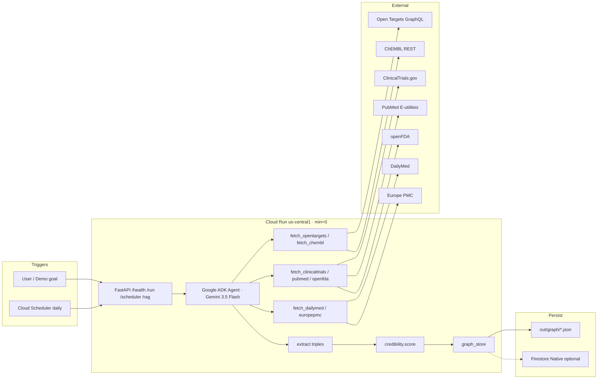

# Architecture

## Overview

Living Evidence Graph is a **text-first** knowledge graph kept fresh by a Google ADK Taskmaster agent. Demo vertical: **pembrolizumab / Keytruda** for **NSCLC / solid tumor**, using only public **APIs**.

**Spine:** Open Targets + ChEMBL → `drug_targets_gene` / `gene_associated_with_disease` / `drug_indicated_for_disease`.  
**Corroboration:** ClinicalTrials.gov, PubMed, openFDA, DailyMed, Europe PMC.

## Agent tools

| Tool | Role |
|------|------|
| `ingest_goal` | Parse goal → brand / ingredient / condition |
| `fetch_sources` | Live seven-source fetch (skip/error structured; no invented IDs) |
| `extract_edges` | Map payloads → nodes/edges (Gemini optional narrative) |
| `upsert_graph` | Merge by id → local JSON (+ Firestore stub) |
| `recompute_trust` | Apply locked credibility formula |
| `daily_refresh` | Full pipeline for Scheduler |
| `rag` (`rag.py`) | Top-k edge retrieve → bare vs grounded Gemini |

## Data / legal rules

- Public APIs only; no PHI; prefer APIs over scraping  
- Never invent IDs / FDA counts  
- openFDA = reports, not rates; no causation; no FDA/NLM endorsement  
- LLM = retrieval-only over graph (no abstract / non-OA full-text training dumps)  
- Attribution: see `LICENSES.md`  
- Gemini via **Gemini API** (AI Studio key); `GOOGLE_GENAI_USE_VERTEXAI=false` by default  

## Demo RAG beat (~30–40s)

1. Load `out/graph/*.json` (Keytruda / NSCLC living graph).  
2. Rank edges by trust + keyword/entity overlap (prefer triangle spine + `evidence_urls`).  
3. Show bare Gemini vs grounded Gemini citing only retrieved edges.  
4. Refuse causation / rates; label FAERS as reports; attribution / no endorsement.

## Future track

Same architecture supports an **NCI ODS Impact Prize Track 1 Ideas** narrative (deadline 2026-10-05 ET) after the Taskmaster submission.
